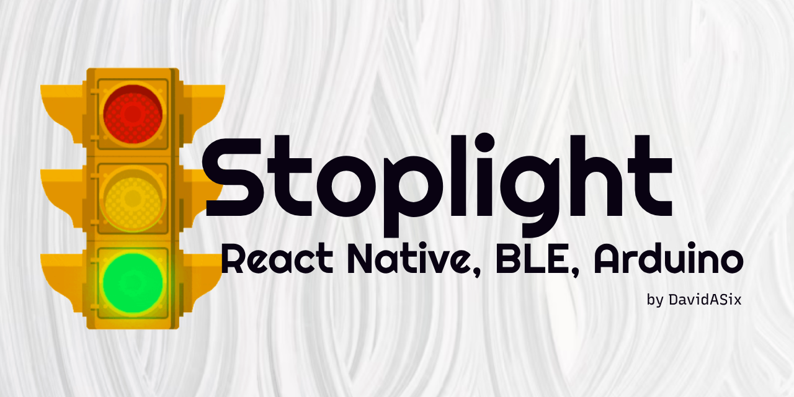
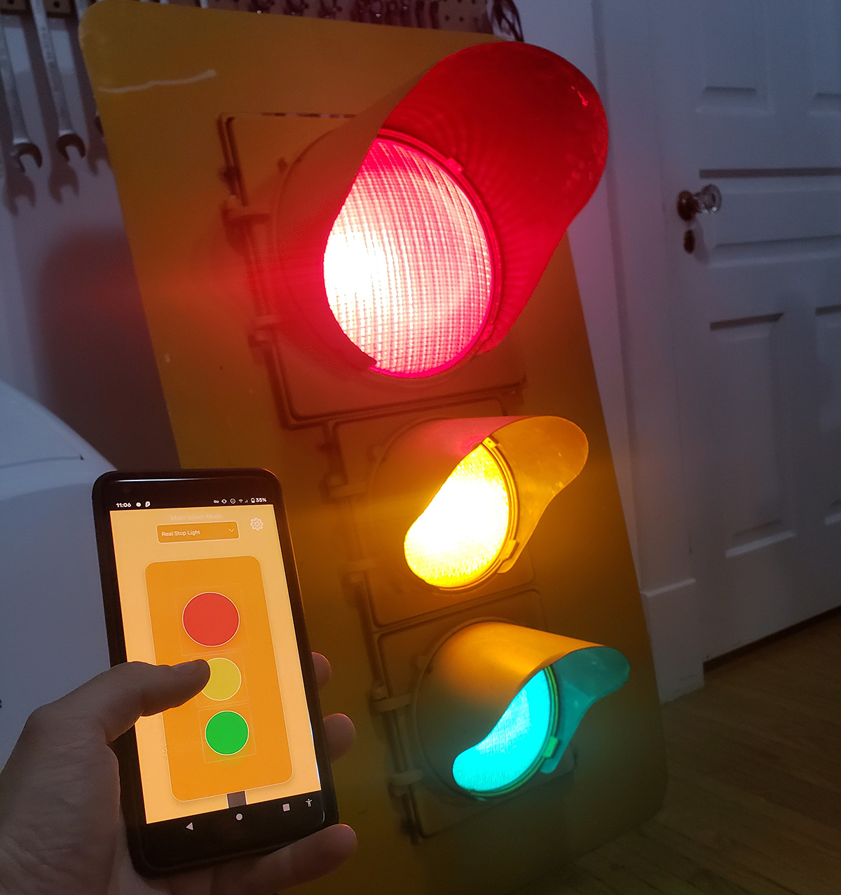
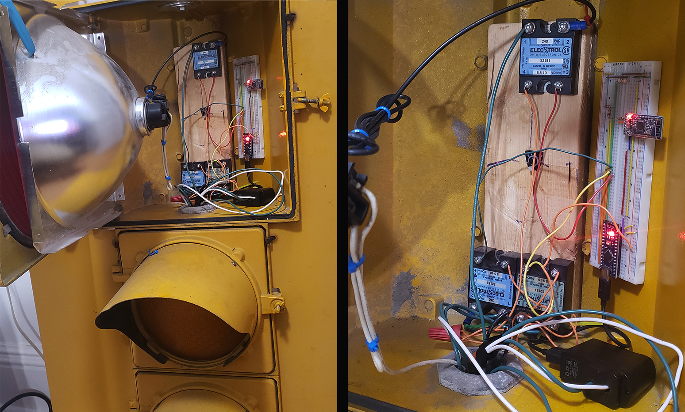
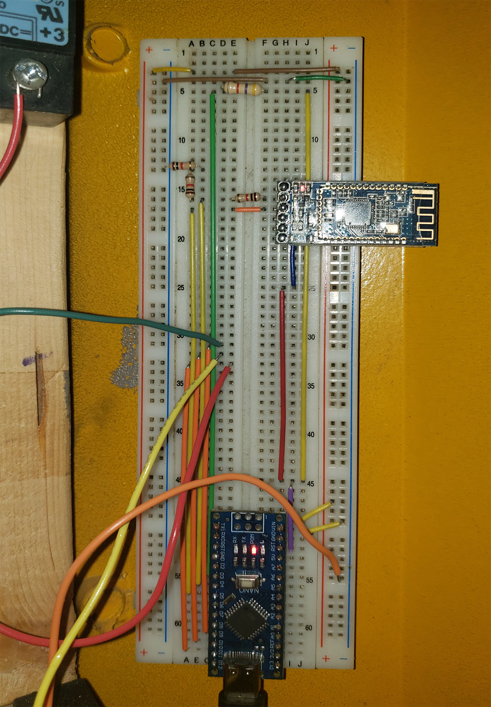

# Arduino StopLight Project
A React Native app to control my real life stoplight, and the accompanying Arduino circuit and code.

Years ago, my grandpa acquired a full sized municipal traffic light from a local scrapyard picker. He brought it home for my dad and I, and at 12 years old it became my first significant Arduino project. Recently the stop light was passed down to me, and so I brought it home and started on a full redesign. I had quite a few ideas for it but in the end I opted for a Bluetooth Low Energy controlled light. I wanted a nice frontend as well, so I wrote a React Native app to control the BLE module.

## Arduino
The modern Arduino circuit consists of 3 solid state relays, an Arduino Nano board, and a BLE HM-10 module. 
Older stoplights like this one use regular 120-volt light bulbs, so I wired the relays into each bulb’s power line, then ran 5V switch lines to the Arduino. I then connected an HM-10 module and aptly named it "Real Stop Light". After some testing I realized that the lights get quite hot, so I included a DS18B20 temperature sensor inside the case near the Arduino. The idea was to have the Arduino auto-shutoff if the lights internal temperature went above a certain point. In the end I opted not to include this feature as the lights are never on long enough to heat up that much.

## Frontend
I wrote a frontend for the project in React Native, but as the app only works with my proprietary hardware I did not publish it to the app store.
The app consists of a home screen and a settings screen. The home screen has a visual representation of the stop light, and a drop down to select the connected BLE device.
After connecting to the stoplight via the settings screen modal the app will send a request to the stoplight to get its current state, which is then displayed on the main screen. Now each lamp can be tapped to turn them on or off, which will update them on the app and the light!